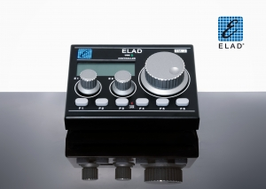

# Tmate 2

This is a python program that interfaces with the Elad (Woodbox Radio) Tmate 2.

For Linux, 50-TMATE2.rules needs to be added to /etc/udev/rules.d to add the Tmate 2 device to the plugdev group so a normal user can access it.

requirements.txt lists the Python libraries that need to be installed:
    pip install -r requirements.txt

## Operation

The TMate 2 appears as a USB HID device. There are over 170 different LCD segments, each controlled by a bit in uploaded data stream. The names of the data fields are taken from the Tmate2LcdSegment.pdf document. There are additional fields to turn the two (Green and Red) LED's on or off, to set the RGB backlight color, to set the contrast and step size for the main encoder and acceleration.

To get the state of the encoders and buttons, read the device. The first byte is a 1, the next 8 bytes are four 16-bit signed words:
1. Main Encoder Position
2. E1 Encoder Posistion
3. E2 Encoder Posistion
4. Button/Switch bit flags (0 if depressed, 1 if not):
    -   1: F1
    -   2: F2
    -   4: F3
    -   8: F4
    -  16: F5
    -  32: F6
    -  64: Main Encoder Push
    - 128: E1 Encoder Push
    - 256: E2 Encoder Push